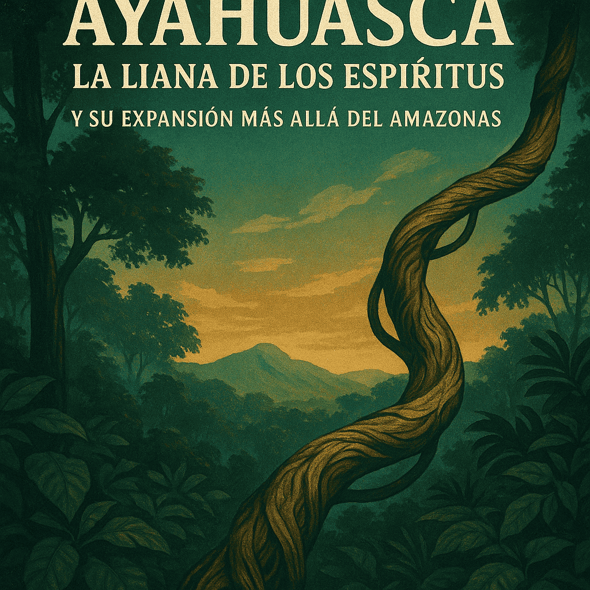

# Ayahuasca: la liana de los espíritus y su expansión más allá del Amazonas

Entre las decenas de plantas psicoactivas utilizadas ancestralmente por pueblos indígenas de todo el mundo, la ayahuasca ocupa un lugar excepcional tanto por su relevancia cultural como por el creciente interés científico y espiritual que ha despertado en las últimas décadas.

Conocida como «la liana de los espíritus» (del quechua aya = espíritu, huasca = liana), esta infusión milenaria originaria de la cuenca amazónica ha sido, desde tiempos inmemoriales, una herramienta central en el chamanismo amazónico, utilizada para la sanación, la visión, la conexión con el mundo espiritual y la guía de comunidades.

## Un legado milenario en diálogo con el mundo moderno
La ayahuasca es una preparación ritual que combina al menos dos plantas: la Banisteriopsis caapi (la liana en sí misma) y la Psychotria viridis (chacruna), rica en DMT.

El efecto sinérgico de estos componentes activa visiones y estados expandidos de conciencia, en contextos que los pueblos indígenas reconocen como encuentros sagrados con entidades, espíritus o sabidurías de la selva.

Sin embargo, en el siglo XX, este uso tradicional comenzó a expandirse más allá del marco chamánico indígena.

A medida que investigadores botánicos, químicos y antropólogos comenzaron a estudiar sus efectos y rituales, nuevas formas de consumo y espiritualidad se desarrollaron en zonas urbanas de Brasil, Perú y otros países, dando origen a los llamados movimientos ayahuasqueros modernos.

## Santo Daime, Barquinha y União do Vegetal: religiones sincréticas
Tal como describe Walter Menozzi en su obra Ayahuasca. La liana de los espíritus, el surgimiento de religiones como Santo Daime, Barquinha y União do Vegetal (UDV) representa un fenómeno único de fusión cultural.

Estas corrientes combinan elementos del catolicismo popular, el espiritismo, la simbología afrobrasileña y la cosmología indígena, con la ayahuasca como sacramento central.

Estas religiones, lejos de replicar mecánicamente los rituales indígenas, han elaborado nuevas teologías, músicas, liturgias y estructuras sociales, en las que la ayahuasca no solo es medicina, sino símbolo de redención, purificación y comunión con lo divino.

## Ayahuasca en el ámbito terapéutico y científico
Al margen del plano religioso y espiritual, la ayahuasca también ha ganado terreno como herramienta terapéutica y objeto de estudio biomédico, especialmente en el tratamiento de traumas, adicciones, depresión y trastornos del estado de ánimo.

Universidades y centros de investigación como el Imperial College de Londres, la Universidad de São Paulo, y otras en Estados Unidos y Europa, han publicado estudios que revelan cómo esta bebida puede inducir estados introspectivos profundos, promover la neuroplasticidad y facilitar procesos de integración emocional cuando es administrada en entornos controlados y con fines terapéuticos.

## Un símbolo de síntesis cultural y jurídica
Menozzi propone que el fenómeno ayahuasquero constituye un caso ejemplar de síntesis sociocultural y jurídica.

En su libro, analiza cómo distintas disciplinas —antropología, farmacología, derecho, historia de las religiones— convergen para tratar de comprender el rol contemporáneo de esta planta.

La ayahuasca no solo plantea preguntas sobre la eficacia médica o los efectos psíquicos, sino también sobre la legalidad, la propiedad intelectual, la apropiación cultural y la necesidad de marcos normativos respetuosos con los pueblos originarios.

## De la Amazonía al mundo: una medicina que interpela
La expansión global de la ayahuasca, aunque rodeada de entusiasmo, también plantea desafíos éticos:

¿puede la medicina de un pueblo convertirse en moda espiritual?

¿Cómo garantizar un uso responsable y respetuoso fuera del contexto indígena?

¿Qué sucede cuando los sistemas de salud modernos intentan integrar prácticas rituales con raíces cosmológicas distintas?

Estas preguntas no tienen respuestas simples, pero sí una urgencia creciente.

Como concluye Menozzi, la ayahuasca no es solo una sustancia: es un símbolo. Un punto de encuentro entre espiritualidad, ciencia, tradición y futuro.

Y en ese cruce, tanto la medicina ancestral como el pensamiento moderno tienen mucho que aprender —y mucho que cuidar.

Menozzi, Walter. (Año de edición). Ayahuasca. La liana de los espíritus. El sacramento mágico-religioso del chamanismo amazónico.