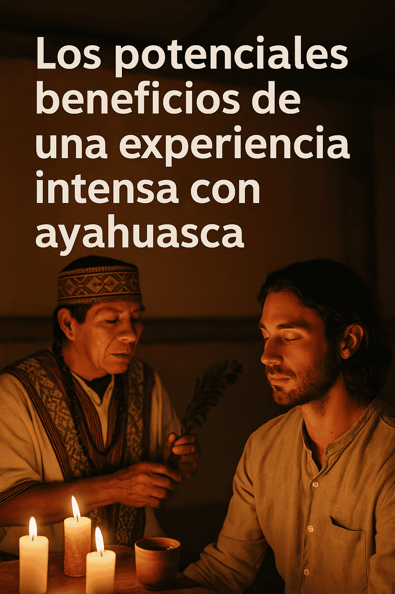

# Ayahuasca: las lecciones ocultas en las experiencias intensas

Un nuevo análisis científico realizado a partir del Global Ayahuasca Survey sugiere que incluso las experiencias emocionalmente desafiantes con ayahuasca pueden tener un efecto terapéutico y transformador en la salud mental de quienes la consumen, siempre que se den bajo contextos guiados y estructurados.

El estudio fue liderado por ICEERS (International Center for Ethnobotanical Education, Research and Service) y se basó en una de las encuestas más amplias jamás realizadas sobre el consumo de esta bebida enteógena: más de 10.000 personas de 50 países participaron en el sondeo.

## ¿Qué ocurre cuando la experiencia es intensa o aterradora?
La investigación se propuso entender una pregunta poco abordada: ¿qué impacto tienen los efectos adversos o difíciles que algunas personas experimentan durante las ceremonias de ayahuasca?

A través de modelos estadísticos, los investigadores encontraron que emociones como el miedo extremo, la pérdida de control o la ansiedad intensa no son infrecuentes, especialmente en personas con antecedentes clínicos de trastornos mentales o en quienes tienen múltiples experiencias previas con la planta.

No obstante, estos eventos no siempre se traducen en deterioro emocional posterior.

Al contrario, muchos participantes interpretaron estas experiencias como parte integral de un proceso de transformación personal, con repercusiones positivas en su bienestar emocional a largo plazo.

“Una de las claves del estudio fue reconocer que una experiencia intensa no es necesariamente negativa, si existe un marco interpretativo que le dé sentido terapéutico o espiritual”, señala el equipo de ICEERS.

## Transformación a través del desafío
El análisis destaca que la intensidad emocional puede actuar como catalizador de procesos de sanación profunda.

Este enfoque coincide con teorías psicológicas sobre crecimiento postraumático, según las cuales atravesar momentos de crisis puede generar cambios positivos si se acompaña adecuadamente.

Entre los principales hallazgos, se identificó que quienes reportaron experiencias espirituales profundas o estados de conexión trascendental durante las ceremonias, también reportaron mejores niveles de salud mental, incluso si durante el proceso atravesaron miedo o confusión.

## La importancia del contexto: guía, ceremonia y comunidad
Uno de los aportes más relevantes del estudio es la relación entre el contexto ceremonial y los efectos a largo plazo.

Las experiencias guiadas por facilitadores expertos, con contención emocional y rituales estructurados, fueron asociadas a mejores resultados que aquellas vividas en entornos no tradicionales o carentes de estructura y acompañamiento.

Asimismo, se enfatiza la necesidad de enfoques comunitarios, en los que el proceso no termina con la ceremonia, sino que se sostiene mediante diálogo, integración y apoyo posterior.

## Ayahuasca y salud mental: posibilidades y desafíos
Este nuevo análisis se suma a una creciente literatura científica que respalda el potencial de la ayahuasca para tratar ansiedad, depresión, adicciones y procesos de duelo.

Sin embargo, también pone sobre la mesa una dimensión que ha recibido escasa atención académica: los efectos adversos o no deseados.

Comprender estos efectos, sin caer en alarmismos ni en idealizaciones, es clave si se desea integrar estas prácticas en modelos de salud pública más amplios o si se contemplan como complemento a tratamientos convencionales.

## Una medicina ancestral en diálogo con la ciencia
El estudio de ICEERS refuerza una idea que cada vez toma más fuerza entre investigadores, clínicos y comunidades indígenas: la sanación no siempre es cómoda ni lineal, pero puede ser profundamente transformadora si se respeta el contexto, la intención y la preparación.

La ayahuasca, como otras plantas maestras, no actúa de forma superficial. Trabaja en capas profundas de la mente y el espíritu, y para hacerlo requiere espacios de contención, acompañamiento ético y visión integradora.

## Referencia del estudio
ICEERS (2024). Adverse effects and psychological transformation in the context of ayahuasca ceremonies: findings from the Global Ayahuasca Survey.
Disponible en: https://iceers.org

En lugares como Iquitos, Perú, centros especializados como La Casa del Jaguar ofrecen experiencias guiadas con ayahuasca y huachuma, dentro de marcos ceremoniales seguros y respetuosos, integrando tradición, contención emocional y acompañamiento antes y después del proceso.

Este tipo de contextos estructurados, lejos de proponer soluciones mágicas, se centran en facilitar procesos reales de introspección, integración y transformación.

La ayahuasca no es un tratamiento simple ni una solución rápida.

Pero en entornos adecuados, y con el acompañamiento correcto, incluso las experiencias más desafiantes pueden convertirse en puertas hacia el autoconocimiento, la resiliencia y la sanación.