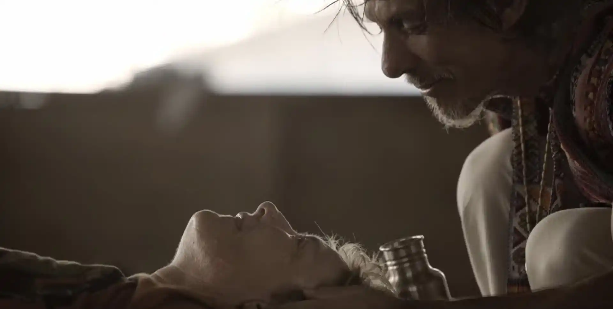

# El documental «Ayahuasca Now» explora la curación psicodélica

El domingo 6 de octubre, Buenos Aires fue testigo del estreno mundial de Ayahuasca Now: Voces de una Guerra Silenciosa, un impactante documental dirigido por el cineasta argentino Carlos Cejas y producido por Mario Stecher.

Con música original del legendario Gustavo Santaolalla, la película explora la sanación de veteranos de guerra a través de la ayahuasca, una medicina ancestral utilizada en la Amazonía peruana.
## Veteranos que buscan curación en la selva amazónica
El documental sigue la trayectoria de veteranos de Vietnam, Afganistán e Irak que, arrastrando el trauma emocional de la guerra, viajan a la Amazonía en busca de sanación a través de la ayahuasca.

A lo largo de la película, Cejas captura tanto la belleza de la naturaleza como la complejidad de la mente humana, en un viaje profundamente personal que busca sanar las heridas invisibles de la guerra.

Inspirada en el clásico Apocalipsis Ahora, la película ofrece una reflexión íntima sobre los estragos de la guerra y la salud mental.

## Gustavo Santaolalla: La banda sonora que conmueve
Uno de los aspectos más destacados de Ayahuasca Now es la música original compuesta por Gustavo Santaolalla, el multipremiado músico argentino que ha trabajado en películas como Babel y El secreto de sus ojos.

Santaolalla proporciona una banda sonora que intensifica las emociones del documental, envolviendo al espectador en una atmósfera profunda y reflexiva que enriquece la narrativa sanadora.