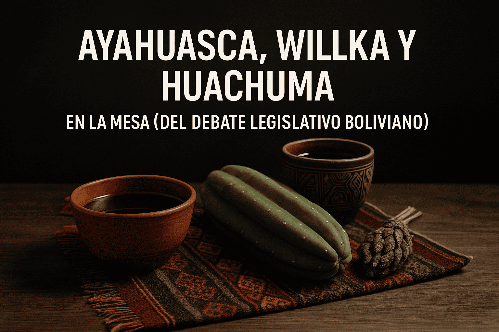

# Ayahuasca, Willka y Huachuma en la mesa del debate legislativo boliviano

La senadora boliviana Silvia Salame presentó recientemente ante la Cámara de Senadores el Proyecto de Ley N° 010/2024-2025 C.S., que propone declarar como patrimonio cultural material e inmaterial del Estado Plurinacional de Bolivia a el Huachuma, la Ayahuasca y el Willka, junto con los saberes tradicionales, usos rituales y conocimientos médicos ancestrales asociados.

El objetivo central del proyecto es establecer una base legal para la protección, conservación y valoración de estas plantas medicinales dentro del territorio boliviano.

La propuesta ha generado una diversidad de reacciones en la esfera pública.

Mientras algunos actores han respaldado la iniciativa como un avance necesario en la preservación del conocimiento ancestral, otros han manifestado opiniones marcadas por la desinformación y el desconocimiento del valor cultural, terapéutico y científico que estas prácticas conllevan.

## Un punto de encuentro entre tradición y ciencia
Desde hace más de tres décadas, universidades de renombre como el Imperial College de Londres y la Universidad de São Paulo, entre muchas otras, han desarrollado investigaciones científicas que exploran el potencial terapéutico de sustancias enteógenas presentes en la Ayahuasca, el San Pedro (Huachuma) y el Willka.

Estos estudios, publicados en revistas académicas revisadas por pares, han documentado su eficacia en el tratamiento de cuadros clínicos como depresión resistente, ansiedad crónica, trastorno por estrés postraumático y adicciones.

Investigaciones recientes (Dos Santos et al., 2016; Barbosa et al., 2012) han destacado que los efectos de estos compuestos no pueden analizarse únicamente desde una perspectiva farmacológica, sino que requieren una comprensión integral que incluya el contexto espiritual, ceremonial y cultural en el que son administrados.

## Un legado vivo más allá de las fronteras
La discusión sobre el valor de estas medicinas no es exclusiva de Bolivia. En países vecinos, como Perú, se han desarrollado espacios que combinan el saber ancestral con enfoques terapéuticos contemporáneos.

Un ejemplo destacado es La Casa del Jaguar, un centro holístico ubicado en la ciudad de Iquitos, en plena Amazonía peruana.

Este centro se ha consolidado como un referente en el uso ceremonial y terapéutico de la Ayahuasca y la Huachuma (Wachuma), ofreciendo procesos de sanación guiados por profesionales y guías experimentados, en condiciones seguras y éticamente estructuradas.

Allí, la medicina se aplica desde una perspectiva integradora: espiritual, emocional y física, con respeto tanto por las raíces indígenas como por las necesidades contemporáneas del individuo.

La experiencia de centros como La Casa del Jaguar muestra que es posible construir modelos de atención intercultural que respeten la tradición sin perder el rigor ni la responsabilidad que exige la práctica con enteógenos.

## Un marco regulatorio frente al uso clandestino
En Bolivia, el uso creciente de plantas enteógenas en contextos informales —fuera de marcos rituales auténticos o de control sanitario— ha creado un escenario de vulnerabilidad tanto para usuarios como para los propios saberes originarios.

La falta de regulación clara ha dado paso a ceremonias sin preparación adecuada, facilitadores sin formación o experiencia, y riesgos físicos o psicológicos mal gestionados.

Esto ha llevado a diversos sectores a demandar una regulación estatal integral, que contemple no solo los aspectos de seguridad, salud y ética, sino también el derecho de los pueblos indígenas a proteger, ejercer y transmitir sus conocimientos medicinales sin que estos sean distorsionados o apropiados con fines comerciales.

## Entre el prejuicio y la oportunidad
Históricamente, el conocimiento indígena ha sido invisibilizado o tachado de superstición.

Sin embargo, en la actualidad, muchas de estas prácticas ancestrales están siendo revalorizadas a través del lente de la neurociencia, la psicología transpersonal y la salud pública global.

La Organización Mundial de la Salud ha advertido sobre el aumento sostenido de los trastornos mentales en todo el mundo.

En este contexto, las prácticas basadas en la etnofarmacología podrían ofrecer nuevas perspectivas complementarias, que no excluyen a la medicina moderna, sino que la enriquecen con saberes milenarios que consideran al ser humano como un todo: cuerpo, mente, alma y comunidad.

## Una mirada a futuro
El proyecto de ley boliviano representa un punto de inflexión en la relación entre el Estado y los conocimientos ancestrales.

Reconocer oficialmente a la Ayahuasca, la Wachuma y el Willka no solo como plantas, sino como patrimonio cultural y herramientas vivas de sanación, podría sentar las bases para políticas públicas más inclusivas, interculturales y coherentes con la identidad plurinacional del país.

Asimismo, experiencias como la de La Casa del Jaguar en Iquitos demuestran que es posible implementar modelos seguros y éticos que honren el origen de estas medicinas, protejan a los participantes y fomenten una relación respetuosa entre tradición e innovación.

La iniciativa en Bolivia abre un debate necesario: ¿qué lugar estamos dispuestos a darle, como sociedad, al conocimiento que ha sanado a generaciones enteras desde antes de la existencia de laboratorios?.

Más que una moda espiritual, más que una herencia folclórica, la medicina ancestral reclama un espacio legítimo desde la ciencia, la cultura y la salud.

Reconocerla, regularla y protegerla no es mirar al pasado. Es abrir una puerta hacia un futuro más consciente, inclusivo y humano.