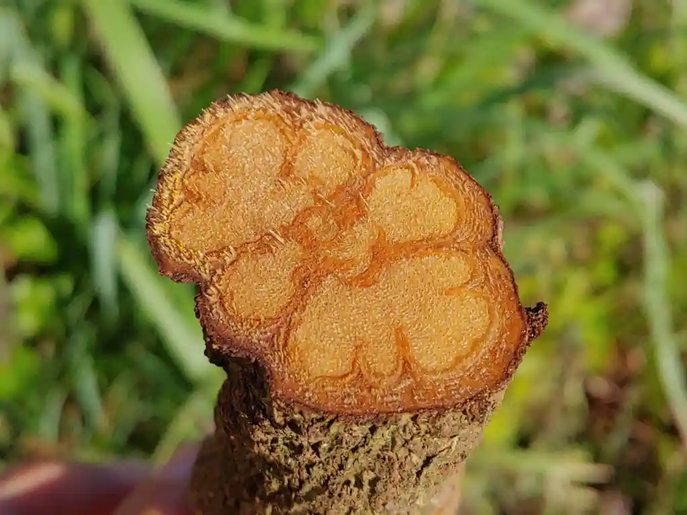
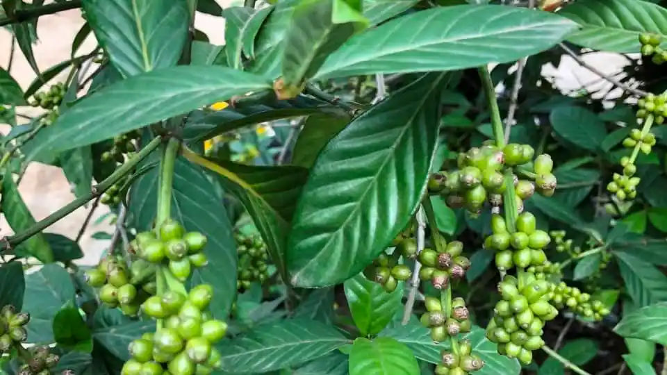

# AYAHUASCA y CHACRUNA, medicina y plantas sagradas

En la Casa del Jaguar, la preparación de la Ayahuasca se realiza con profundo respeto y siguiendo rigurosos protocolos de salud y pureza espiritual.

Utilizamos exclusivamente la liana de Ayahuasca y las hojas de Chacruna, cocinados en una decocción sagrada tal como nos fue enseñado por los espíritus de las plantas maestras durante ceremonia.

Cada preparación honra la tradición ancestral y busca preservar la integridad y el poder sanador de la medicina.

## La Liana de la Ayahuasca
- El nombre científico es Banisteriopsis caapi.
- B. caapi contiene beta-carbolinas (harmina, harmalina y tetrahidroharmina)
- Banisteriopsis caapi es una planta trepadora de la familia Malpighiaceae que crece en toda la selva amazónica. 
## Hojas de Chacruna

- El nombre científico de la chacruna es Psychotria viridis.
- P. viridis es fuente de dimetiltriptamina (DMT).
- Psychotria viridis es un arbusto perenne de la familia Rubiaceae, la misma familia que el café.