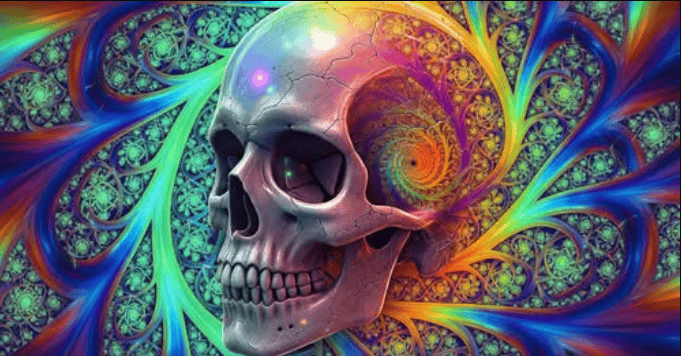
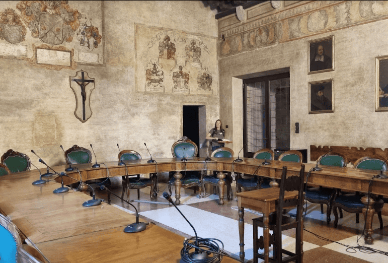

# Científicos estudiaron a usuarios de ayahuasca: sus hallazgos sobre la muerte son impactantes.

Las personas que consumen ayahuasca regularmente, podrían tener una forma fundamentalmente diferente de relacionarse con la muerte.

Un nuevo estudio publicado en la revista Psychopharmacology indica que quienes consumen ayahuasca a largo plazo tienden a mostrar menos miedo, ansiedad y evasión ante la muerte, y en cambio, muestran mayor aceptación.

Estos efectos parecen estar impulsados ​​no por creencias espirituales ni rasgos de personalidad, sino por una actitud psicológica conocida como:

«aceptación de la impermanencia».

Los hallazgos provienen de investigadores de la Universidad de Haifa, quienes buscaron comprender mejor cómo los psicodélicos influyen en el pensamiento y el comportamiento de las personas en torno a la mortalidad.

Según sus datos, no es la creencia en una vida después de la muerte ni un cambio en las perspectivas metafísicas lo que predice una reducción de la ansiedad ante la muerte.

En cambio, los resultados sugieren que aprender a aceptar el cambio y la naturaleza transitoria de la vida puede ser fundamental para que la ayahuasca ayude a las personas a relacionarse con la muerte con mayor serenidad.

La ayahuasca es una bebida psicoactiva utilizada tradicionalmente por los grupos indígenas amazónicos en rituales curativos y espirituales.

Esta bebida contiene el poderoso DMT (N,N-dimetiltriptamina), junto con alcaloides harmala que la hacen activa por vía oral.

Muchos usuarios describen visiones profundamente emotivas, a menudo relacionadas con la muerte, durante sus experiencias.

Estas pueden incluir la sensación de muerte personal, renacimiento simbólico, contacto con personas fallecidas o sentimientos de disolución del ego (la pérdida temporal del sentido de identidad).

El equipo de investigación, dirigido por Jonathan David y Yair Dor-Ziderman, se interesó en este contenido recurrente relacionado con la muerte.

Los registros históricos, las tradiciones culturales y estudios previos sugieren que la ayahuasca frecuentemente evoca visiones o pensamientos relacionados con la muerte.

En una encuesta, más de la mitad de los usuarios de ayahuasca afirmaron haber experimentado lo que se sentía como una «muerte personal» durante una sesión.

Otros describieron visiones relacionadas con tumbas, espíritus o temas de vida después de la muerte.

A pesar de estos informes consistentes, los estudios empíricos que evalúan sistemáticamente cómo la ayahuaca afecta la cognición y las emociones relacionadas con la muerte siguen siendo escasos.

Los trabajos anteriores se han basado a menudo en autoinformes limitados, han carecido de grupos de control y han pasado por alto posibles factores psicológicos mediadores.

El presente estudio se propuso abordar estas deficiencias con un diseño más riguroso.

“Nos motivó la falta de investigaciones que exploren cómo el consumo de ayahuaca podría relacionarse con la forma en que las personas piensan y aceptan el aspecto más inevitable de la vida: la muerte.

La mayoría de los estudios en este ámbito se han centrado en otros psicodélicos y en los efectos clínicos o a corto plazo, mientras que nosotros queríamos explorar cambios más duraderos en la personalidad.

También queríamos comprender por qué podrían ocurrir estos cambios, algo que ha estado en gran medida ausente en la literatura existente”, declaró David a PsyPost.

Existe un gran revuelo en el ámbito popular y científico sobre la eficacia de los psicodélicos para generar un cambio fundamental en nuestra respuesta al tema de la muerte.

En particular, la ayahuasca se ha descrito durante mucho tiempo como la «liana de los muertos» (traducción del quechua) y los temas relacionados con la muerte son omnipresentes en las visiones de ayahuasca —añadió Dor-Ziderman, directora de investigación de la Universidad de Haifa e investigadora visitante de la Universidad de Padua—.

Sin embargo, ha habido sorprendentemente poca investigación empírica sobre cómo estos encuentros moldean la relación con la mortalidad. Además, la mayoría de los estudios existentes se basan en escalas individuales de autoinforme y pasan por alto las capas inconscientes, conductuales y cognitivas de cómo los humanos procesamos la muerte.

Queríamos proporcionar una evaluación integral y multidimensional del «procesamiento de la muerte» e identificar los mecanismos causales que median o explican las diferencias a largo plazo en el procesamiento de la muerte entre usuarios y no usuarios de ayahuasca.

Para su estudio, los investigadores reclutaron a 107 participantes: 54 usuarios experimentados de ayahuasca y 53 no usuarios. Los grupos se emparejaron por edad, sexo, nivel educativo y estado de salud mental.

Ninguno de los no usuarios tenía antecedentes de consumo de psicodélicos, mientras que el grupo de ayahuasca había consumido la bebida un promedio de 56 veces, a menudo a lo largo de varios años.

Para examinar cómo estas personas se relacionan con la muerte, los investigadores administraron un conjunto detallado de cuestionarios y tareas conductuales.

Estas incluían mediciones de ansiedad ante la muerte, miedo a la muerte personal, conductas de evitación de la muerte y aceptación de la muerte.

También utilizaron tareas implícitas, como los tiempos de respuesta a palabras relacionadas con la muerte, para capturar reacciones inconscientes.

La idea era obtener una visión amplia y multidimensional de cómo las personas piensan y sienten sobre la mortalidad.

Los investigadores encontraron diferencias estadísticamente significativas entre los dos grupos.

En comparación con quienes no consumían ayahuasca, los consumidores de ayahuasca obtuvieron puntuaciones más bajas en ansiedad ante la muerte, fueron menos propensos a evitar pensar en ella, mostraron menos respuestas de miedo y expresaron una mayor aceptación de la mortalidad.

Estos patrones se mantuvieron tanto en los autoinformes como en las medidas conductuales.