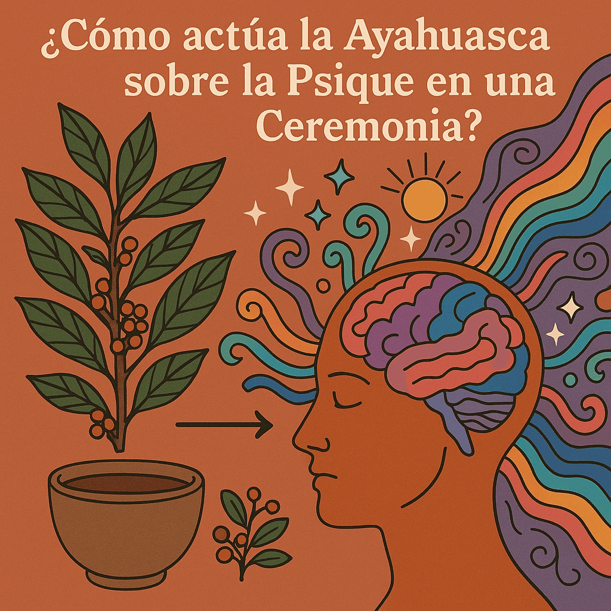
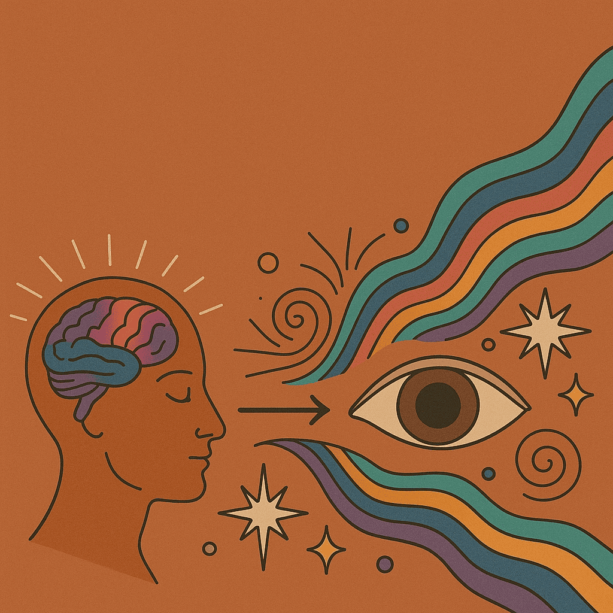
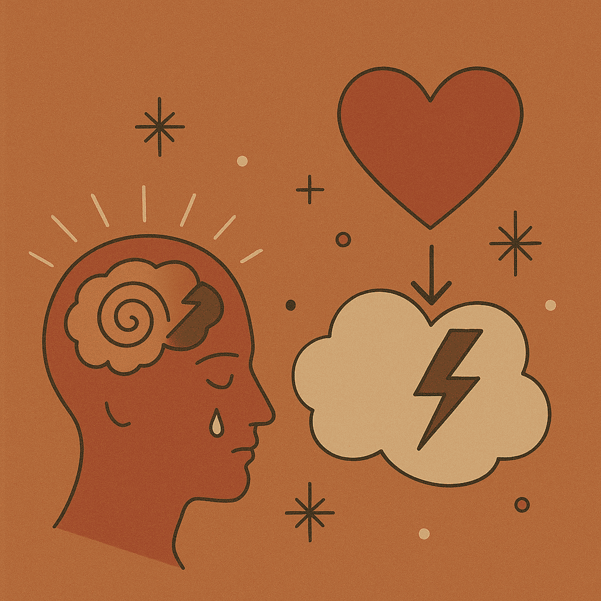
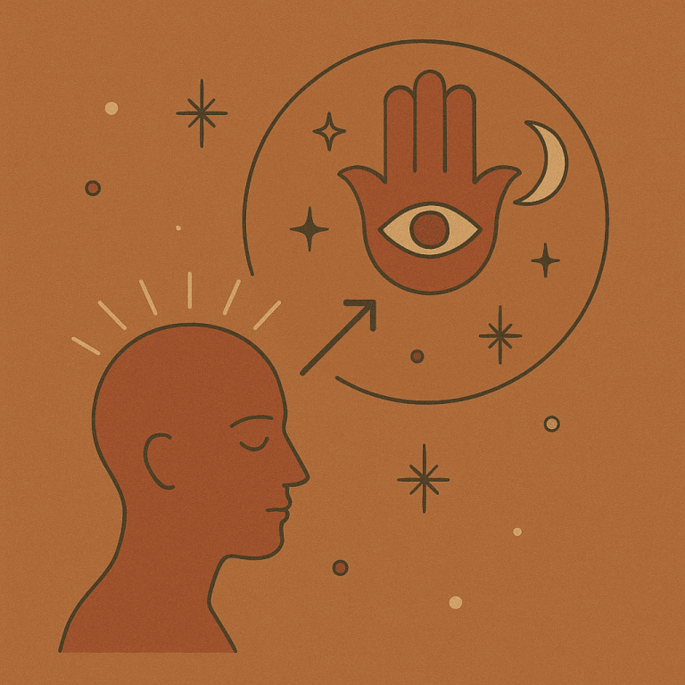
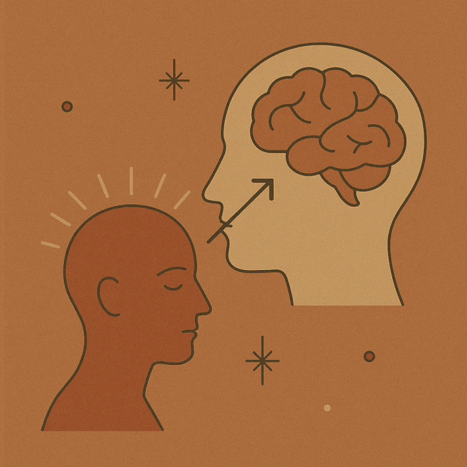

# ¿Cómo actúa la Ayahuasca sobre la Psique en una Ceremonia?

Durante una ceremonia de Ayahuasca, la forma en que esta medicina actúa en la psique (mente) puede variar de persona a persona y de sesión a sesión.
Sin embargo, se observan ciertos patrones comunes en muchas experiencias:

## Expansión de la Conciencia

La Ayahuasca tiende a expandir la conciencia, permitiendo a los participantes acceder a niveles más profundos de percepción y comprensión de sí mismos y del mundo que los rodea.

## Exploración Emocional

La medicina puede facilitar la exploración de emociones reprimidas o subconscientes, conduciendo a menudo a la liberación de traumas emocionales y al alivio del sufrimiento psicológico.

## Conexión Espiritual

Muchas personas experimentan una sensación de conexión con lo divino, lo cósmico o lo trascendente durante una ceremonia de ayahuasca, proporcionando una sensación de propósito, significado y unidad con el universo.

## Autoconocimiento

La Ayahuasca a menudo proporciona a los participantes una visión más clara de sí mismos, lo que les permite comprender mejor sus patrones de pensamiento y comportamiento, así como sus relaciones con los demás y el mundo que los rodea.

## Procesamiento del Trauma

La medicina puede facilitar la revisión y el procesamiento de experiencias pasadas, incluidos traumas emocionales o recuerdos dolorosos, lo que puede conducir a una mayor aceptación y curación de estas experiencias.

En resumen, la Ayahuasca puede actuar como una poderosa herramienta para la introspección, la curación emocional y espiritual y el crecimiento personal durante una ceremonia, brindando a los participantes la oportunidad de explorar aspectos profundos de su psique y encontrar un mayor sentido de conexión y bienestar.