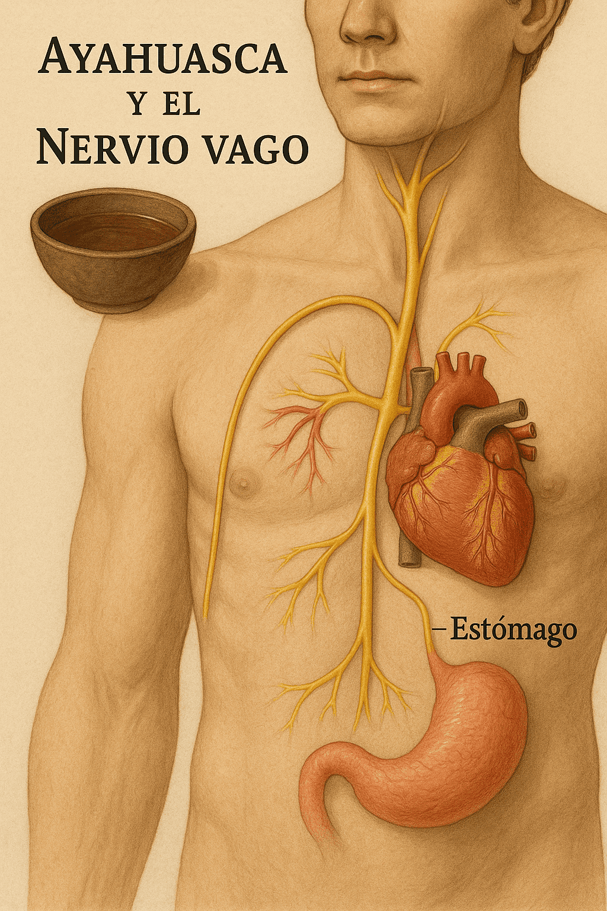
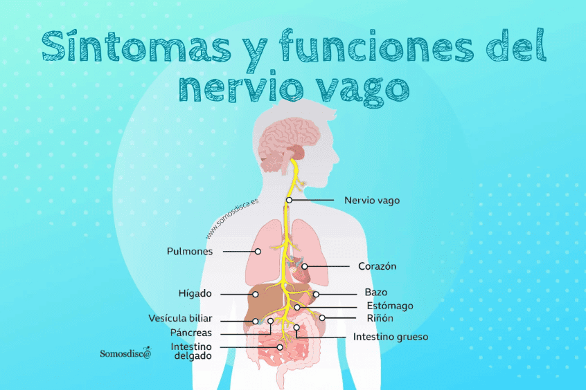

# Conexión entre el nervio vago y la absorción de la ayahuasca: una perspectiva científica, chamánica y psicológica

La ayahuasca, una decocción ancestral, ha captado la atención de científicos y terapeutas por sus efectos profundos en la mente y el cuerpo.

Su interacción con el nervio vago, el principal canal de comunicación entre el sistema digestivo, el corazón y el cerebro, ofrece una explicación fascinante de sus efectos.

## Perspectiva científica
El nervio vago, décimo par craneal, inerva múltiples órganos, incluyendo el estómago, el corazón y el cerebro. Desempeña un papel crucial en la regulación de funciones vitales como la digestión, la frecuencia cardíaca y la respuesta al estrés .

La ayahuasca contiene DMT (dimetiltriptamina), un potente psicoactivo, y β-carbolinas como la harmina, que inhiben la monoamino oxidasa (MAO), permitiendo que el DMT sea activo por vía oral .

La absorción de estos compuestos ocurre en el tracto gastrointestinal, donde el nervio vago detecta cambios y transmite señales al cerebro, facilitando una comunicación bidireccional conocida como eje intestino-cerebro .

## Perspectiva chamánica
En las tradiciones amazónicas, el nervio vago es percibido como el canal que conecta el cuerpo físico con el espiritual.

Durante las ceremonias de ayahuasca, se busca activar esta conexión para alcanzar estados de conciencia ampliada y sanación.

Los chamanes consideran que la ayahuasca «enseña» al cuerpo a través de visiones y sensaciones, facilitadas por esta red de comunicación interna.

## Perspectiva psicológica
Desde la psicología, la activación del nervio vago está asociada con estados de relajación, regulación emocional y bienestar.

La ayahuasca, al interactuar con este nervio, puede inducir estados de introspección profunda, permitiendo a los individuos procesar traumas y emociones reprimidas.

Además, prácticas como la respiración profunda y el canto, comunes en las ceremonias, estimulan el nervio vago, potenciando los efectos terapéuticos.

La interacción entre la ayahuasca y el nervio vago ofrece una explicación multidimensional de sus efectos, integrando conocimientos científicos, chamánicos y psicológicos.

Esta conexión destaca la importancia de comprender el cuerpo humano como un sistema interconectado, donde la tradición y la ciencia convergen para ofrecer nuevas perspectivas de sanación y autoconocimiento.