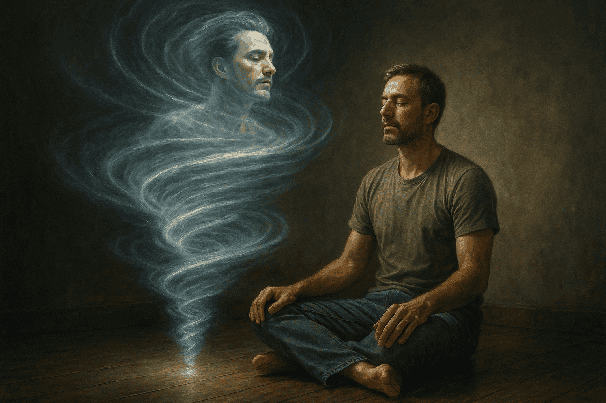

# Cuando el espíritu se rompe en lugar de sanar: Ayahuasca, asombro y el equilibrio sagrado del alma

Como chamán amazónico con más de una década de experiencia en ceremonias de ayahuasca reflexiono, con visión crítica y ancestral, sobre los nuevos estudios científicos que revelan que no toda experiencia mística es necesariamente sanadora.

¿Qué sucede cuando el asombro se vuelve demasiado inmenso para el alma moderna?

## Palabra de fuego desde la selva
He guiado cientos de ceremonias en la Amazonía peruana, con la ayahuasca —nuestra medicina sagrada— como canal de sanación, espejo del alma y medicina de los mundos invisibles.

Pero en estos tiempos, donde la selva se vuelve destino de moda y el espíritu se confunde con el turismo espiritual, veo con preocupación cómo muchos vienen buscando respuestas rápidas y experiencias intensas… sin preparación, sin contención y sin humildad.

Una investigación publicada recientemente en la Journal of Psychoactive Drugs ha dicho algo que nosotros, los guardianes de la medicina, ya sabíamos: cuando el asombro se desborda, el alma puede romperse en lugar de sanar.

## No todo lo inmenso transforma — a veces desintegra
Los investigadores, liderados por Lee Kannis-Dymand de la Universidad de Sunshine Coast, estudiaron a 60 personas que participaron en retiros legales con ayahuasca, muchos en países como Perú y Brasil, donde esta medicina está protegida por leyes que reconocen su valor ancestral y terapéutico.

Ellos no midieron solo si la experiencia fue intensa o “bonita”, sino cómo fue integrada luego por cada participante.

Y lo que encontraron es profundo: cuando el asombro místico se vuelve demasiado grande, se pierde el equilibrio emocional, provocando confusión, ansiedad e incluso angustia.

## El peligro de sentirse «nada» sin guía espiritual
Hay un término en el estudio que me toca el corazón: “vastidad superflua”. Es ese momento en que la mente humana moderna no puede sostener lo que el espíritu revela.

Donde el ego se desintegra, pero no hay raíces para sostenerse en esa transformación.

He visto esto antes: jóvenes que lloran con desesperación, diciendo que “han muerto”, que “han desaparecido”, y que no saben cómo regresar al mundo.

No es que la ayahuasca haya fallado —es que fueron lanzados al misterio sin mapa, sin preparación, sin sostén.

## La preparación importa más que la intensidad
No se trata de cuántas lianas bebes, ni de cuántas serpientes o jaguares viste en la visión.

Se trata de quién te acompaña, en qué contexto y con qué propósito. La ciencia lo confirma: las personas que vivieron ceremonias con contención adecuada, facilitadores responsables y una intención clara, reportaron mejores efectos duraderos.

Aquellos que buscaban solo “la experiencia fuerte” o repitieron ceremonias sin integración, perdieron el beneficio emocional.

En mi años de experiencia, eso es como pedirle a la selva que grite, cuando aún no has aprendido a escuchar su susurro.

## El llamado del chamanismo ancestral
Yo, que aprendí de mi maestro Dan Reynolds y de la misma madre Ayahuasca, te lo digo con amor pero con firmeza: la ayahuasca no es un espectáculo, ni un atajo a la felicidad. Es una maestra severa, que muestra lo que más temes ver. Por eso:

No tomes la medicina sin propósito.
No busques visiones si no estás listo para cambiar tu vida.
Y nunca lo hagas sin un guía que camine contigo antes, durante y después.
## El riesgo de la banalización espiritual
La ciencia moderna empieza a tocar el misterio, pero aún le falta respeto. No basta con cuestionarios o estadísticas.

Hay realidades del alma que no caben en tablas de datos. El peligro hoy no es la ayahuasca.

El peligro es el consumo emocional sin conciencia espiritual.

¿Quieres realmente sanar? Entonces prepárate. Haz dieta. Escucha. Honra. Y cuando la inmensidad venga —porque vendrá— recíbela con humildad, no con ansiedad de impacto.

En palabras del maestro Dan: «quien no sabe caminar en la tierra, no debe volar con las estrellas.»

La verdadera medicina no se bebe en un viaje. Se bebe en cada decisión, en cada silencio, en cada acto de respeto hacia ti y hacia la Tierra.

No busques lo místico. Busca lo verdadero. La ayahuasca hará el resto.