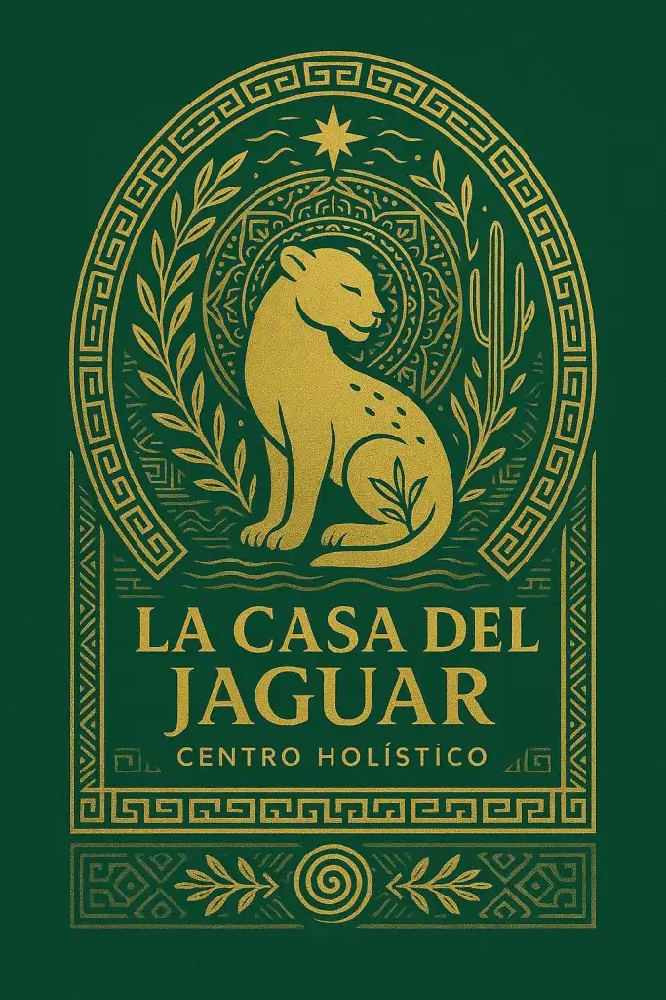

# El Mensaje del Agua: La Conexión Sagrada entre Ciencia, Psicología y Chamanismo 

El Dr. Masaru Emoto fue un investigador japonés que revolucionó nuestra percepción del agua.

Sus experimentos, basados en la cristalización de moléculas bajo diferentes estímulos como palabras, pensamientos y música, demostraron que el agua reacciona a la energía emocional.

Palabras como «amor» o «gratitud» generaban estructuras armónicas y hermosas; en cambio, palabras como “odio” o “miedo” formaban cristales caóticos.

Desde una visión chamánica, esto confirma lo que los sabios amazónicos han sostenido durante milenios:

el agua es espíritu, conciencia y espejo de nuestras emociones.

El agua absorbe la vibración de todo lo que la rodea, tal como lo hace nuestro cuerpo, nuestra mente y nuestro espíritu.

## La sabiduría ancestral valida la ciencia moderna
En las ceremonias de sanación con plantas sagradas como la Ayahuasca o el San Pedro, el agua es un elemento ritual central.

Es usada para limpiar, para bendecir y como vía de conexión entre el mundo físico y el mundo espiritual.

Cuando un curandero entona un icarito sobre una botella de agua, la está programando con intención curativa, igual que los experimentos de Emoto sugieren que las palabras modifican la estructura del agua.

¿Y si nuestras palabras pudieran reprogramar nuestra salud? ¿Y si nuestros pensamientos tuvieran el poder de sanar el cuerpo, solo con la fuerza de la intención?

Eso es lo que el Dr. Emoto dejó como herencia. Y los pueblos indígenas lo han sabido desde siempre.

## La psicología también lo confirma: somos lo que sentimos
Desde el enfoque psicológico, estas investigaciones nos invitan a reflexionar sobre el poder del lenguaje interno.

Cada vez que te repites «no puedo», «no valgo», o «no merezco», estás afectando tu campo energético. Hoy sabemos que el cuerpo humano está compuesto en más de un 70% por agua, y que las emociones dejan huella física.

La terapia psicológica moderna ha empezado a integrar prácticas de visualización, afirmaciones positivas, y programación mental.

Todo esto tiene una raíz en lo que el agua ya nos enseñó: nuestra energía moldea nuestra realidad.

## Vive la experiencia en La Casa del Jaguar
En el corazón de la Amazonía, La Casa del Jaguar te ofrece la oportunidad de vivir este conocimiento en carne y espíritu.

Aquí, bajo la guía de maestros y terapeutas, podrás participar en ceremonias sagradas donde el agua, las plantas y la intención se unen para ayudarte a reconectar con tu esencia y reprogramar tu vida.

Te invitamos a vivir una ceremonia consciente, donde las enseñanzas del Dr. Emoto se integran con rituales milenarios, para que veas con tus propios ojos cómo tus emociones transforman el agua… y cómo tú puedes transformarte también.

## ¿Y tú, qué le estás diciendo a tu agua interna?
Si sientes que es momento de sanar, de reconectar y de experimentar algo que va más allá de lo racional, este llamado es para ti.

Reserva tu cupo con anticipación. Las ceremonias se realizan todos los días, pero el espacio es limitado. Escríbenos por WhatsApp o visita nuestro perfil y prepárate para vivir lo sagrado en un entorno seguro, natural y profundamente amoroso.