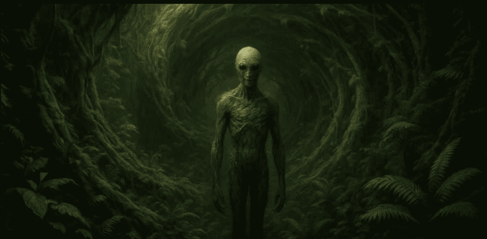

# Encuentros con entidades durante ceremonias de ayahuasca transforman las creencias religiosas, especialmente en los hombres

Un reciente estudio publicado en el Journal of Psychoactive Drugs reveló que las personas que viven encuentros con entidades durante ceremonias con ayahuasca tienden a experimentar cambios duraderos en sus creencias religiosas, especialmente los hombres.

Según los resultados, quienes antes se consideraban ateos o agnósticos reportaron una mayor apertura hacia ideas de naturaleza espiritual o trascendental después de estas experiencias.

La ayahuasca es una bebida psicoactiva ancestral preparada con la vid Banisteriopsis caapi y la hoja Psychotria viridis.

Utilizada desde hace siglos en rituales amazónicos de sanación y expansión de la conciencia, combina DMT (dimetiltriptamina), un potente alucinógeno, con inhibidores de la monoaminooxidasa (IMAO) que permiten su efecto activo por vía oral.

Su consumo suele estar acompañado por intensas visiones, introspección emocional y, en ocasiones, procesos físicos de purificación conocidos como “la purga”.

Durante estas ceremonias, muchos participantes describen encuentros con entidades autónomas o inteligentes, percibidas como espíritus, guías, animales sagrados, ancestros o incluso presencias de origen no humano.

Estas manifestaciones suelen transmitir mensajes, ofrecer orientación o provocar experiencias de revelación espiritual.

Mientras algunos interpretan estos fenómenos como experiencias místicas genuinas, otros los entienden como proyecciones del inconsciente bajo el efecto del DMT.

Desde la neurociencia, se plantea que dichas visiones podrían originarse en una activación inusual de las áreas cerebrales asociadas a la cognición social, la imaginación y la percepción de agencia.

## El estudio y sus hallazgos
La investigación fue liderada por Yitong Xin, junto a Roland R. Griffiths y Alan K. Davis, con una muestra de 415 usuarios de ayahuasca que participaron en una encuesta en línea. La edad promedio fue de 39 años y el 61% eran hombres.

Los participantes informaron su identidad religiosa antes y después de haber experimentado un encuentro con una entidad durante el consumo de la bebida.

Antes de la experiencia, el 20% de los hombres y el 8% de las mujeres se identificaban como ateos, mientras que el 27% de los hombres y el 23% de las mujeres se declaraban agnósticos, evidenciando que los varones tendían a ser menos religiosos.

Sin embargo, tras el encuentro con entidades, las cifras cambiaron notablemente: solo el 7% de los hombres y el 3% de las mujeres se mantuvieron como ateos, y el porcentaje de agnósticos se redujo a alrededor del 11%–12% en ambos géneros.

Los investigadores concluyen que los hombres mostraron una mayor transformación en sus creencias religiosas, lo que sugiere diferencias en la forma en que cada género procesa e interpreta las experiencias espirituales bajo los efectos de la ayahuasca.

## Implicaciones y límites del estudio
El estudio ofrece una perspectiva fascinante sobre el potencial de los estados psicodélicos para influir en las creencias religiosas y la espiritualidad personal.

No obstante, los autores aclaran que no se contó con un grupo de control, por lo que no puede afirmarse con certeza que los cambios observados sean consecuencia directa de los encuentros con entidades o si intervienen otros factores contextuales o psicológicos.

Más allá de su limitación metodológica, la investigación amplía la comprensión de cómo la ayahuasca puede actuar como catalizador de transformaciones profundas en la cosmovisión y la identidad espiritual, abriendo nuevas preguntas sobre la relación entre neurociencia, religión y experiencias místicas.