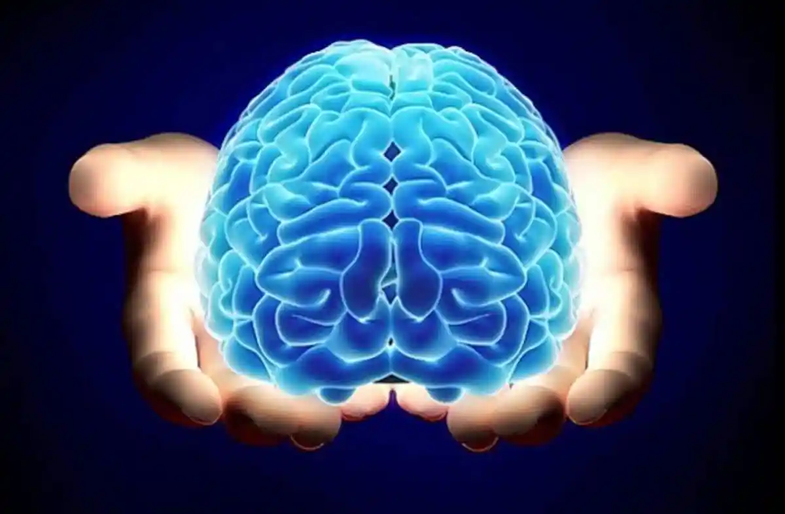

# Beneficios de la ayahuasca: un resumen de la investigación científica

La investigación sobre la ayahuasca, bebida utilizada tradicionalmente por diversas culturas indígenas de la región amazónica, ha captado el interés de la comunidad científica en las últimas décadas debido a sus potenciales efectos terapéuticos sobre la salud mental y emocional.

A medida que la investigación continúa avanzando, se descubren aspectos nuevos y fascinantes de los beneficios de esta antigua medicina.

## Reducción de la depresión y la ansiedad
Numerosos estudios han sugerido que la ayahuasca puede tener efectos prometedores para aliviar la depresión y la ansiedad.

Las investigaciones han demostrado que los componentes de la ayahuasca, como la harmalina y la dimetiltriptamina (DMT), pueden afectar positivamente los circuitos cerebrales relacionados con el estado de ánimo y la regulación emocional, lo que podría conducir a mejoras significativas en los síntomas depresivos y de ansiedad.

## Sanando Traumas Emocionales
Se ha observado que la ayahuasca facilita la exploración y el procesamiento de traumas emocionales pasados.

Estudios sugieren que esta medicina puede ayudar a las personas a afrontar y liberar recuerdos dolorosos, lo que facilita una mayor resolución y sanación de heridas emocionales profundas.

## Mejora de la conexión espiritual
Para muchas personas, la ayahuasca se ha asociado con experiencias espirituales profundas y trascendentes.

La investigación ha explorado cómo la medicina puede facilitar una mayor conexión con uno mismo, con los demás y con el universo en su conjunto, lo que puede conducir a un mayor sentido de propósito y significado en la vida.

## Reducción de Adicciones
Algunos estudios preliminares han sugerido que la ayahuasca podría ser útil en el tratamiento de adicciones, como el alcoholismo y la drogodependencia..

Se ha observado que el medicamento promueve la introspección y la autorreflexión, lo que podría ayudar a las personas a enfrentar y superar patrones adictivos destructivos.

## Cambios Neurobiológicos
Investigaciones recientes han comenzado a explorar los cambios neurobiológicos inducidos por la ayahuasca.

Se ha demostrado que el medicamento afecta la actividad cerebral y los niveles de neurotransmisores, lo que sugiere que podría tener efectos duraderos en la plasticidad cerebral y la función cognitiva.

