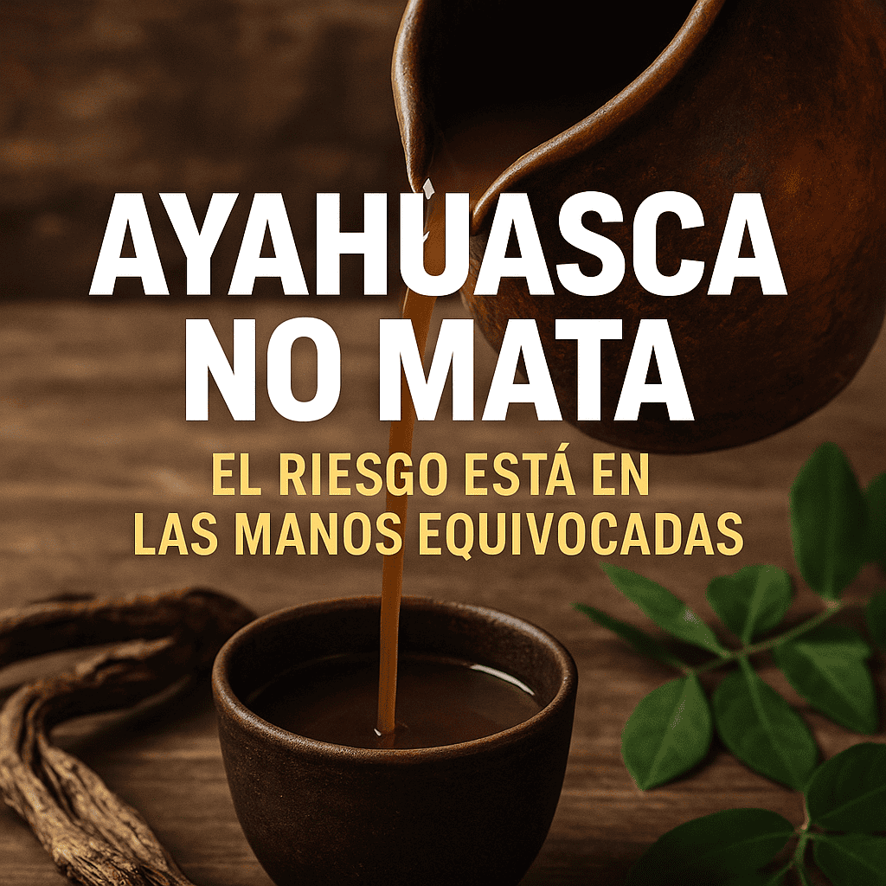

# La Ayahuasca no mata: el riesgo está en las manos equivocadas

Una mirada científica, espiritual y legal a la creciente crisis de intoxicaciones en ceremonias mal gestionadas

## La química de una medicina ancestral
La ayahuasca, bebida ancestral utilizada por pueblos indígenas amazónicos, se elabora tradicionalmente con solo dos ingredientes naturales: la liana Banisteriopsis caapi (ayahuasca) y las hojas de Psychotria viridis (chacruna), hervidas en agua durante varias horas.

Esta combinación permite la activación oral de la DMT (dimetiltriptamina), un potente enteógeno, gracias a la presencia de alcaloides inhibidores de la monoaminooxidasa (IMAO) en la liana.

Estudios como los publicados por el Journal of Psychoactive Drugs y Frontiers in Pharmacology concluyen que esta preparación ancestral no presenta toxicidad aguda ni riesgo letal cuando se consume en condiciones adecuadas y bajo supervisión ritual segura.

## ¿Por qué ocurren muertes?
Las muertes asociadas a “ceremonias de ayahuasca” reportadas en la última década tienen algo en común: la medicina estaba adulterada, mal preparada o mal administrada.

Casos documentados por PubMed y Forensic Science International indican que algunas personas mezclan ayahuasca con sustancias como toé (Brugmansia), cocaína, benzodiacepinas, incluso metales pesados o alcohol, buscando “potenciar visiones”.

Estas adiciones no solo rompen con la tradición espiritual amazónica, sino que provocan efectos neurotóxicos, cardiovasculares severos y, en algunos casos, la muerte.

## El verdadero crimen: la negligencia disfrazada de medicina
Muchos “facilitadores” o “chamanes” modernos no son verdaderos guardianes de la tradición, sino mestizos sin formación médica ni iniciación ancestral, que se hacen pasar por nativos para lucrar con la creciente demanda del turismo espiritual.

En su ignorancia o ambición, improvisan espacios sin higiene, sin protocolos médicos, sin anamnesis de los participantes ni control de interacciones farmacológicas.

Como advierte la Organización Mundial de la Salud (OMS), la falta de regulación y formación en las medicinas tradicionales es una de las principales causas de incidentes graves y muertes en contextos rituales no controlados.

## Medicina para el alma, no espectáculo
Desde la mirada chamánica, la ayahuasca es un “espíritu femenino curador”, y su uso ceremonial implica disciplina, respeto, contención emocional, dieta, silencio y guía ética.

Su propósito no es inducir alucinaciones, sino sanar bloqueos espirituales, físicos y emocionales.

Cuando es mal usada como entretenimiento o con fines egoicos, el espíritu de la planta “abandona el espacio”, según palabras de maestros shipibo.

## Lo que se necesita: regulación, formación y verdad
El gobierno debe implementar protocolos de inspección, registro y vigilancia sobre centros y personas que ofrecen ceremonias.

La medicina no es culpable; es el hombre sin ética ni conocimiento quien la convierte en un riesgo.

Buscar información, preguntar por la preparación, conocer los ingredientes, exigir higiene y transparencia: eso salva vidas.

La ignorancia también mata, y es deber del Estado y de la sociedad combatir el abuso de lo sagrado como un delito, no como una anécdota cultural.

### Fuentes consultadas:
- NIH: Toxicología y Farmacología de la Ayahuasca
- Frontiers in Pharmacology – Ayahuasca: Uses, Chemistry, and Legal Perspectives
- Forensic Science International: Toxicological Findings in Ayahuasca-Related Deaths
- OMS – Estrategias sobre medicina tradicional