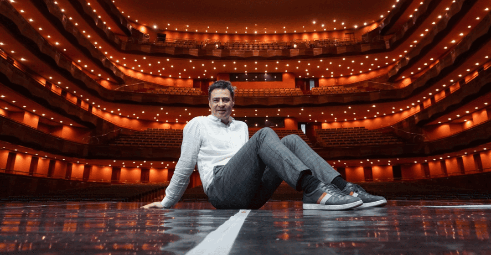
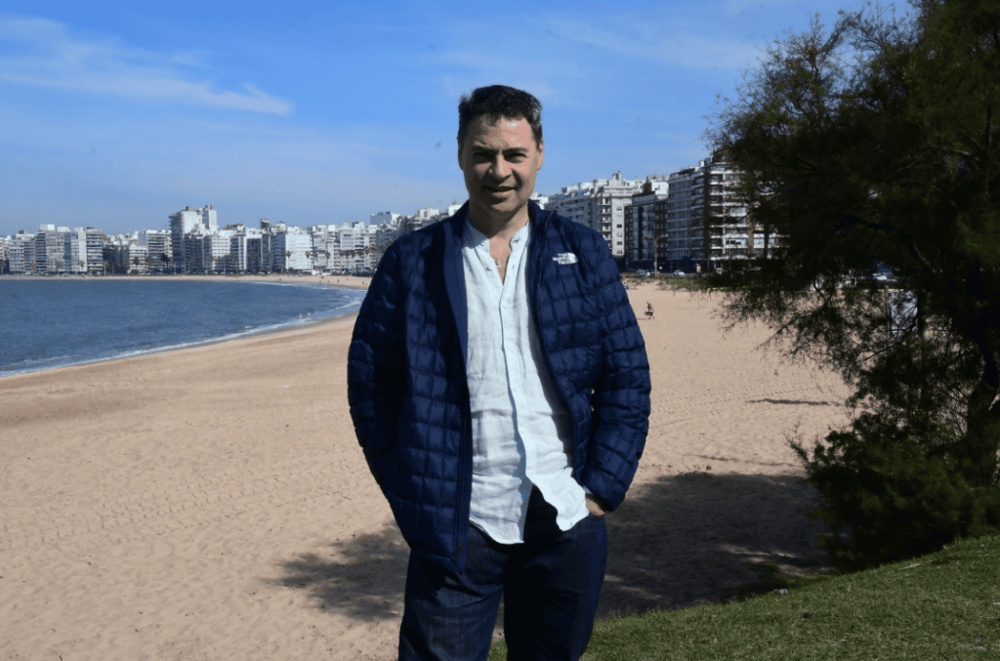
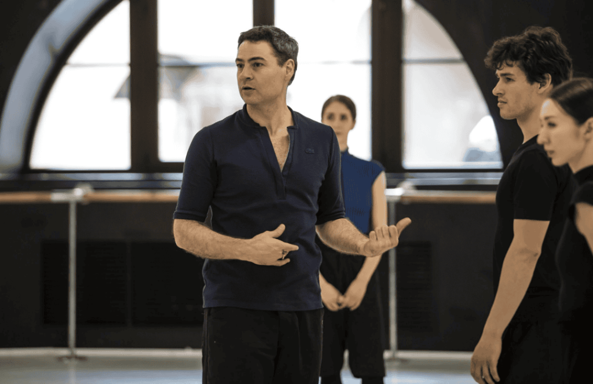

# La estrella que renació con la Madre Ayahuasca: el viaje espiritual de Iñaki Urlezaga

Cuando el alma danza más allá del cuerpo

Hay caminos que se bailan con los pies y otros que solo pueden recorrerse con el alma.

Así ha sido el viaje de Iñaki Urlezaga, uno de los grandes nombres del ballet argentino, que tras conquistar los escenarios más prestigiosos del mundo —el Royal Opera House, el Bolshói, y frente a figuras como Lady Di, Elton John y Rod Stewart— encontró una transformación mucho más profunda, silenciosa y sagrada: la que ocurre dentro, en los territorios invisibles del espíritu.

## Del aplauso externo al llamado interno
Desde muy pequeño, la danza fue su medicina. Con apenas meses de vida, la música clásica era su único alivio ante un dolor físico inexplicable.

Su cuerpo encontró el lenguaje antes que las palabras.

Pero no fue hasta después de décadas de escenarios y éxito mundial que comprendió que había algo más por explorar. Una búsqueda que ninguna ovación podía llenar: el deseo de conocerse más allá del ego, del personaje y del artista.

Fue entonces cuando el espíritu de la Ayahuasca lo llamó.

Ayahuasca: la planta que despierta la memoria del alma
La experiencia con la Ayahuasca, como relata Iñaki, no fue una curiosidad superficial, sino una puerta hacia estados superiores de conciencia.

En cada ceremonia, el cuerpo que antes danzaba ante reinas y artistas, se rendía ahora ante la sabiduría de la selva y del espíritu.

Lo que recibió fue claridad, profundidad y una compasión que solo se alcanza cuando uno se atreve a mirar hacia adentro.

“La Ayahuasca amplía la conciencia… te lleva a un estado mucho más elevado. Me conocí mucho más. Entrar en el inconsciente te hace ser más comprensivo de vos mismo y de los porqués de la vida.”

Estas palabras no nacen desde la mente racional de un intelectual, sino desde el corazón de alguien que ha vivido la sanación como un ritual interno, donde el alma se encuentra con sus sombras y se abraza en su totalidad.

## El arte como camino chamánico
Iñaki no solo bailó. Encarnó el arte como una vía de autoconocimiento. A través de la danza, conectó con lo invisible, con lo que no se dice pero se siente.

Y con la medicina, profundizó esa conexión. Su testimonio es el de un guerrero espiritual moderno: alguien que ha vivido el éxito, pero también el vacío; que ha conocido el ruido, pero eligió el silencio.

La medicina lo llevó, como muchos buscadores auténticos, a tocar dimensiones más sutiles: regresiones a vidas pasadas, registros akáshicos, bioenergética… pero sobre todo, al reencuentro consigo mismo.

“¿Qué has sanado?”, le preguntaron.
“A mí”, respondió.

## La danza del alma
Hoy, cuando Urlezaga presenta Libertango, rinde homenaje no solo a Piazzolla y al tango, sino también a su propio renacimiento.

En el escenario baila su linaje, su desarraigo, su búsqueda, su despertar. Ya no es solo un coreógrafo. Es un hombre medicina que honra su camino, paso a paso, nota a nota.

Y si bien no lleva un penacho ni canta ícaros, su arte vibra con la misma fuerza que un tambor ceremonial.

Porque, al fin y al cabo, el chamán y el artista auténtico comparten la misma misión: tocar el alma del otro para ayudarle a recordar quién es.

## La Casa del Jaguar honra estos caminos de despertar
En nuestras ceremonias, sabemos que cada persona llega con una historia, con una danza interior por descubrir.

La Ayahuasca no es solo una planta, es una maestra. Y cuando se recibe con humildad y guía, se convierte en un espejo claro del alma.

Si tú también sientes el llamado a mirar dentro, a recordar, a sanar… este es tu momento.
Te esperamos con respeto, con intención y con el corazón abierto.