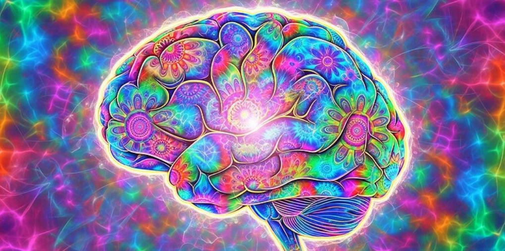

# Las experiencias psicodélicas podrían reducir el consumo de cannabis y aumentar la flexibilidad mental, según nuevo estudio

Un estudio publicado en el Journal of Psychoactive Drugs revela que las experiencias con psicodélicos clásicos, estarían asociadas a una disminución en el consumo problemático de cannabis y a una mayor flexibilidad psicológica.

## Una mirada a la relación entre psicodélicos y autocontrol
En los últimos años, la ciencia ha comenzado a explorar cómo las experiencias psicodélicas —vivencias intensas de expansión de conciencia inducidas por sustancias como el LSD o la psilocibina— podrían ayudar a las personas a modificar hábitos y patrones mentales arraigados.

Un reciente estudio liderado por Bruno Roméo, del Departamento de Psiquiatría y Adicciones del Hospital Paul Brousse y la Universidad Paris-Saclay, aporta nuevas evidencias: las experiencias psicodélicas estarían relacionadas con una reducción significativa del consumo de cannabis y una mayor capacidad de adaptación emocional.

## Una disminución notable del consumo problemático de cannabis
El estudio encuestó a 152 consumidores de cannabis que afirmaron haber tenido una experiencia psicodélica “personalmente significativa” al menos seis meses antes.

Los resultados fueron claros: tras dicha experiencia, los niveles de consumo problemático disminuyeron alrededor de un 38%, según las puntuaciones de la Prueba de Identificación de Trastornos por Consumo de Cannabis (CUDIT).

Antes de la experiencia psicodélica, un 23% de los participantes cumplía criterios de trastorno grave por consumo de cannabis.

Seis meses después, esta cifra se redujo a solo un 9%. Además, los antojos, la tolerancia y la duración diaria de intoxicación también se redujeron notablemente.

Curiosamente, la mayoría no tomó psicodélicos con la intención de dejar el cannabis, sino por motivos recreativos o de autoexploración.

Sin embargo, los efectos positivos sobre su relación con la sustancia aparecieron como una consecuencia inesperada.

## Más flexibilidad psicológica, mejor salud mental
Junto con la reducción del consumo, los investigadores observaron un incremento significativo en la flexibilidad psicológica, un rasgo clave en la salud mental que implica la capacidad de mantenerse abierto a las emociones difíciles y adaptarse a los cambios sin perder el rumbo personal.

Las personas que reportaron experiencias psicodélicas más intensas o de tipo “místico” fueron también las que mostraron mayores mejoras tanto en la flexibilidad psicológica como en la disminución del consumo.

Esto sugiere que la profundidad de la experiencia subjetiva podría desempeñar un papel importante en los beneficios observados.

## Limitaciones y próximos pasos
Como todo estudio retrospectivo basado en autoinformes, los autores advierten sobre ciertas limitaciones.

Los resultados dependen de la memoria de los participantes, y no existió un grupo de control que no hubiera tomado psicodélicos, lo que impide establecer una relación de causalidad directa.

Además, los participantes fueron reclutados a través de la Sociedad Francesa de Psicodélicos, lo que podría haber atraído a personas con experiencias positivas previas, generando un posible sesgo de selección.

Aun así, los hallazgos son prometedores. Los investigadores proponen realizar estudios prospectivos y clínicos controlados que sigan a los participantes antes, durante y después de una experiencia psicodélica, incorporando además preparación terapéutica y acompañamiento de integración.

## Un nuevo horizonte terapéutico
El trastorno por consumo de cannabis afecta aproximadamente a uno de cada diez usuarios, y actualmente no existen medicamentos aprobados para su tratamiento.

Las terapias conductuales ayudan, pero sus resultados suelen ser limitados en el tiempo.

Frente a este panorama, los psicodélicos podrían representar una nueva vía terapéutica.

Ya existen evidencias de su eficacia potencial en trastornos por consumo de tabaco y alcohol, y ahora, esta investigación sugiere que también podrían promover una relación más saludable con el cannabis.

“Los participantes informaron un aumento concomitante en la flexibilidad psicológica después de sus experiencias psicodélicas, que se correlacionó con la intensidad de la experiencia”, explicó Roméo a PsyPost.

En otras palabras, los psicodélicos podrían no solo ayudar a reducir el consumo, sino también fortalecer la mente frente a las emociones difíciles.