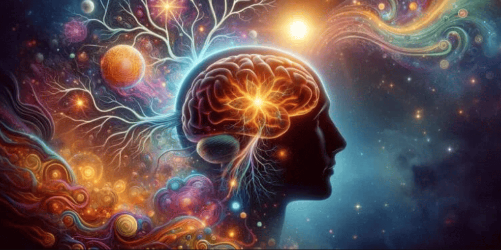

# Las visiones cercanas a la muerte y los viajes con DMT comparten similitudes inquietantes, pero existen diferencias clave que los diferencian.

¿Te has preguntado alguna vez por qué las personas que casi mueren a menudo describen cómo se precipitan hacia una luz sobrenatural o cómo ven su vida pasar rápidamente ante sus ojos?.

Quizás también hayas oído hablar de la potente dimetiltriptamina (DMT), presente de forma natural en la Ayahuasca y cómo podría generar las llamadas experiencias cercanas a la muerte.

En un estudio reciente, se comparó ambos tipos de experiencias y se descubrió que comparten similitudes fascinantes, pero también diferencias cruciales.

Algunos estudios han sugerido que existen coincidencias básicas entre las experiencias que se tienen durante una experiencia cercana a la muerte y el consumo de DMT.

Pero la investigación doctoral fue la primera en realizar una comparación cualitativa profunda y matizada entre los viajes con DMT y las ECM.

También fue el primer estudio de campo de este tipo, que capturó experiencias auténticas en lugar de pedir a los participantes que tomaran DMT en un laboratorio.

Los Investigadores usaron una técnica de entrevista inspirada en la micro-fenomenología, un nuevo enfoque científico que busca ayudar a las personas a descubrir dimensiones cotidianas pero inaccesibles de nuestra experiencia vivida.

Este enfoque ayuda a los entrevistados a recordar detalles de su experiencia, pidiéndoles que la articulen momento a momento con sus propias palabras y en orden cronológico, a la vez que amplían diferentes dimensiones, como las experiencias sensoriales o emocionales.

Esto les permitió explorar las experiencias con mayor detalle. Por ejemplo, cómo se expresaban específicamente los temas generales, como encontrarse con seres inusuales o sentir que uno se disuelve por completo.

También les permitió medir la frecuencia con la que ocurría cada tipo de detalle.

Luego, compararon estas descripciones con el análisis de los datos brutos de otro equipo, de su publicación de 2018, que estudiaba 34 ECM inducidas por paro cardíaco.

El estudio descubrió que ambos tipos de experiencias también presentaban diferencias importantes que los investigadores habían pasado por alto previamente.

Las personas de ambos grupos informaron comúnmente sentirse separadas de sus cuerpos, encontrarse con seres, viajar a través de espacios misteriosos como túneles o vacíos, y ver luces brillantes.

Estas experiencias compartidas apuntan a procesos cerebrales similares, como alteraciones en las partes del cerebro que gestionan el mapa de nuestro cuerpo, cómo simulamos las perspectivas de otras personas, la percepción sensorial y el procesamiento espacial.

Sin embargo, los viajes con DMT casi nunca implicaban la clásica «revisión de la vida» de las ECM, ni dramatizaciones del regreso a la vida de los participantes, como el encuentro con un umbral simbólico sin retorno.

Por el contrario, las ECM prácticamente nunca implicaban la visualización de patrones geométricos complejos característicos de los viajes con DMT.

La diferencia más evidente, sin embargo, residía en la forma en que se representaban estos rasgos.

Por ejemplo, mientras que las personas con ECM solían reportar encuentros con seres queridos fallecidos, los usuarios de DMT describían universalmente encuentros con seres de otro mundo o extraterrestres.

Encontrarse repentinamente transformado en un espíritu que observaba el propio cuerpo desde arriba, antes de ser recibido por un guía, parecía ser característico de las ECM.

El DMT simplemente disolvía la consciencia corporal de las personas, que se sumergían rápidamente en un mundo trascendente habitado por payasos mecánicos o científicos serpentinos.

Los investigadores sugirieron que una combinación de biología cerebral compartida y psicología personal podría explicar por qué estas experiencias son tan similares en sus elementos genéricos, pero difieren en su contenido.

Algunos fenómenos especialmente intrigantes en las ECM (experiencias cercanas a la muerte), como la experiencia del «Pico en Darién», donde los moribundos ven a otros que no sabían que estaban muertos, o perciben correctamente cosas a su alrededor estando fuera del cuerpo, aún no han sido completamente explicados por la neurociencia.

Pero las características comunes mencionadas anteriormente probablemente provienen directamente de cómo el DMT o el estado cercano a la muerte afecta a nuestro cerebro.

Piensen en estos como escenarios universales, creados por la biología de nuestro cerebro.

Pero las historias que asociamos a estos escenarios (ver a nuestra tía muerta o un extraterrestre octópode de múltiples ojos) están influenciadas por nuestros antecedentes personales, expectativas culturales y recuerdos.

## DMT y el cerebro
Los primeros investigadores psicodélicos sugirieron que el DMT podría inundar el cerebro durante las experiencias cercanas a la muerte. Pero la vida no es tan simple, ni tampoco lo es la muerte.

Estudios han demostrado, por ejemplo, que las ratas producen DMT no solo a través de sus glándulas pineales, sino también en su tejido cortical, incluso en el momento de la muerte.

Sin embargo, aún no hay evidencia de que esto ocurra en el cerebro humano.

Incluso si los humanos producen DMT en cantidades psicoactivas en plena agonía, las enzimas de nuestro cuerpo podrían descomponerla antes de que llegue al cerebro o tenga suficiente impacto en él.

Además, la serotonina aumenta drásticamente cuando se está bajo estrés extremo, lo que en sí mismo puede conferir efectos psicodélicos, y también se adhiere al receptor de serotonina con mayor facilidad que la DMT, posiblemente eclipsando cualquier actividad de la DMT.

Este artículo se republica de The Conversation bajo una licencia Creative Commons. Lea el artículo original.