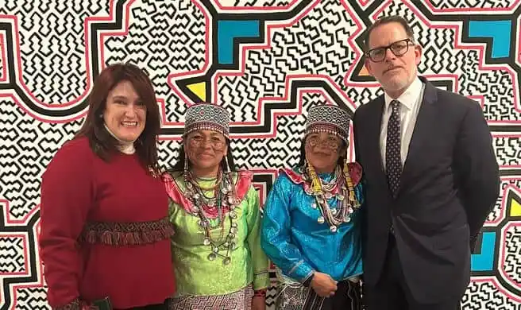
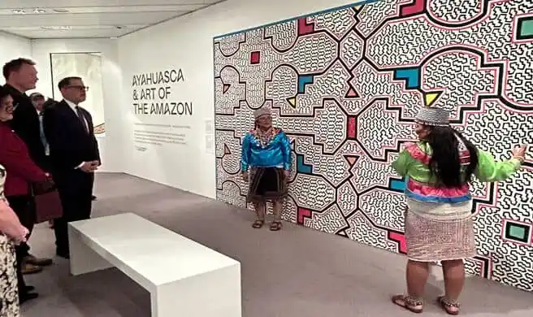

# Piezas relacionadas con la Ayahuasca y la cosmovisión amazónica

Visión del mundo amazónico – La exposición:

«Ayahuasca y el arte de la Amazonía peruana»

Se inauguró el 13 de septiembre en el Sainsbury Centre for Visual Arts de Norwich, Reino Unido. Estará abierta al público hasta febrero de 2025.

La exposición tiene diferentes componentes, que presentan el uso de la Ayahuasca en la producción de arte específicamente para la comunidad Shipibo-Conibo de la Amazonía peruana y su íntima conexión con su espiritualidad.

Entre estas piezas se encuentran textiles con patrones psicodélicos “kené”, que demuestran la cosmología amazónica.

Múltiples obras de arte en cerámica, escultura o pintura vinculadas al consumo de Ayahuasca.

## Mural Kené
Un mural “kené” pintado a mano por dos representantes del Colectivo de Muralistas Shipibas, Delicia Milka Franco Ahuanari y Zoila Maynas Soto, quienes también compartieron cómo utilizan su arte para establecer una conexión sagrada con la naturaleza, lograr la sanación y la paz.

Una experiencia guiada de realidad virtual simulando el efecto del consumo de ayahuasca.

El evento fue inaugurado por el director del Centro Sainsbury de Artes Visuales y profesor de Arte y Arqueología de la Universidad de East Anglia, Jago Cooper.

Quien luego dio paso al Embajador del Perú en el Reino Unido, Ignacio Higueras, quien destacó la importancia del uso tradicional de la ayahuasca para las culturas amazónicas, simbolizando además el profundo respeto que estas comunidades tienen por el medio ambiente, las tradiciones y nuestros ancestros.

Al final de la ceremonia de apertura, hubo un agradecimiento especial al Sainsbury Centre por albergar la exposición en el Reino Unido, al Musée du Quai Branly en París por hacerla posible y a los talentosos artistas Shipibo-Conibo, por poder acercar el arte amazónico al público en general..

Por último, el presidente del Museo del Quai Branly-Jacques Chirac, Emmanuel Kasarhérou, agradeció al Centro Sainsbury por permitir traer la exposición de París a Londres, así como al embajador Higueras por su apoyo y difusión.

También reflexionó sobre la importancia de espacios como este para desmitificar el uso de la ayahuasca como elemento nocivo, y contextualizarlo en un marco tradicional y ancestral.