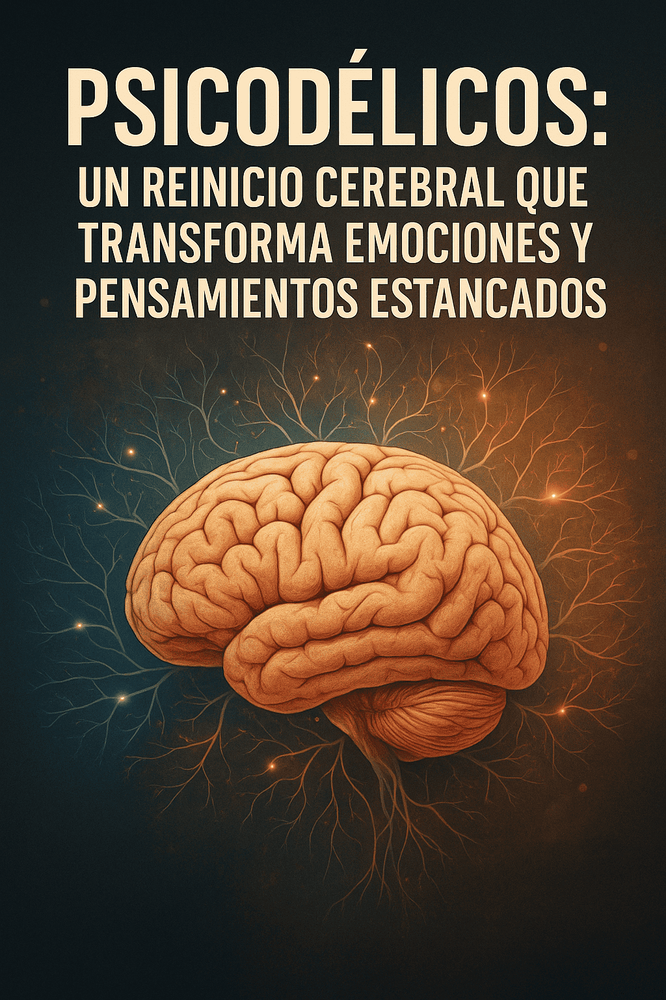

# Psicodélicos: un reinicio cerebral que transforma emociones y pensamientos estancados

Los avances en neurociencia están devolviendo el protagonismo a un grupo de sustancias que durante décadas fueron marginadas del ámbito clínico: los psicodélicos.

Un número creciente de investigaciones, respaldadas por algunas de las instituciones médicas más prestigiosas del mundo, sugiere que estos compuestos pueden tener un potente efecto transformador sobre la mente humana, especialmente en contextos terapéuticos controlados.

## Una nueva forma de sanar la mente: el reinicio cerebral
El Dr. Jerrold Rosenbaum, ex jefe de psiquiatría del Hospital General de Massachusetts (MGH) y actual director del Centro para la Neurociencia de los Psicodélicos, compara el efecto de estas sustancias con un reinicio cerebral.

“Es como reiniciar tu computadora”, explica.

Los psicodélicos producen alteraciones temporales en la actividad cerebral que permiten desbloquear patrones rígidos de pensamiento y abrir caminos hacia la reestructuración emocional.

Este proceso, de acuerdo con Rosenbaum, ocurre en tres niveles clave:

Disminución temporal de la red de modo por defecto, responsable de la autoconciencia y la rumiación.
Aumento de la neuroplasticidad, permitiendo la creación de nuevas conexiones sinápticas.
Acceso transitorio a estados de introspección profunda, facilitando el procesamiento de traumas y emociones bloqueadas.
Este enfoque es conocido como terapia asistida por psicodélicos, y se realiza en entornos clínicos bajo acompañamiento terapéutico.

## Evidencia científica creciente
Estudios recientes han generado resultados sólidos. Uno de ellos, publicado en JAMA Psychiatry (2021), reveló que la psilocibina produjo mejoras significativas y sostenidas en pacientes con trastorno depresivo mayor.

Por otro lado, una investigación publicada en el New England Journal of Medicine encontró que dos dosis de psilocibina fueron igual o más efectivas que el tratamiento con escitalopram, uno de los antidepresivos más utilizados.

La revista Nature también documentó la eficacia de la MDMA para tratar trastorno de estrés postraumático (PTSD) severo, concluyendo que esta terapia —realizada bajo protocolos rigurosos— fue tanto eficaz como segura.

Adicionalmente, la ketamina, ya aprobada en varios países, ha demostrado ser útil en casos de depresión resistente y es utilizada de forma ambulatoria en ciertos centros de salud mental.

Enlace a estudio de JAMA Psychiatry (2021):

https://jamanetwork.com/journals/jamapsychiatry/fullarticle/2772630

Enlace a NEJM sobre psilocibina vs escitalopram:

https://www.nejm.org/doi/full/10.1056/NEJMoa2032994

Enlace a estudio de Nature sobre MDMA y PTSD:

https://www.nature.com/articles/s41591-021-01336-3

## Aportes en cuidados paliativos
Una línea emergente de investigación se centra en pacientes en etapa terminal.

Estudios preliminares han documentado que el uso controlado de psicodélicos puede ayudar a reducir el miedo a la muerte, generar aceptación y permitir una vivencia espiritual significativa en los últimos momentos de vida.

Estos hallazgos, aunque aún en fase experimental en la mayoría de países, abren la puerta a nuevas formas de atención compasiva e integral.

## Riesgos y limitaciones
No obstante, el uso de psicodélicos conlleva riesgos potenciales. Algunos compuestos como la MDMA pueden generar euforia, lo que incrementa el riesgo de uso recreativo no controlado.

Efectos adversos reportados incluyen mareos, náuseas, disociación severa, ansiedad aguda o pánico, especialmente en contextos no supervisados.

El consumo sin guía ni entorno estructurado puede derivar en experiencias psicológicas difíciles. Por ello, expertos insisten en la importancia de que cualquier uso se realice bajo acompañamiento profesional, ético y seguro.

## Reflexión final: hacia un uso consciente y respetuoso
Los psicodélicos no son soluciones mágicas, pero sí herramientas potentes que —bien utilizadas— pueden facilitar transformaciones profundas en quienes han llegado a un punto muerto en su salud emocional. La clave está en el contexto, la intención y la contención.

En distintos lugares del mundo, existen centros que combinan estos conocimientos ancestrales y científicos desde un enfoque integrador.

Uno de ellos es La Casa del Jaguar, ubicada en Iquitos, Perú, donde se realizan ceremonias tradicionales con Ayahuasca y Huachuma (San Pedro) guiadas en entornos seguros, respetuosos y profundamente sanadores.

Ahí, la experiencia es tratada como parte de un proceso de transformación emocional y espiritual, no como una terapia alternativa sino como un camino personal hacia la integración.

En una era marcada por el aumento de los trastornos mentales y la búsqueda de sentido, la ciencia y la espiritualidad parecen, por fin, volver a encontrarse.

### ¿Deseas saber más?
Consulta fuentes científicas y centros especializados para comprender los riesgos y beneficios de estas terapias:
📘 MAPS – Multidisciplinary Association for Psychedelic Studies
📘 Johns Hopkins Center for Psychedelic and Consciousness Research
📘 Massachusetts General Hospital – Center for the Neuroscience of Psychedelics