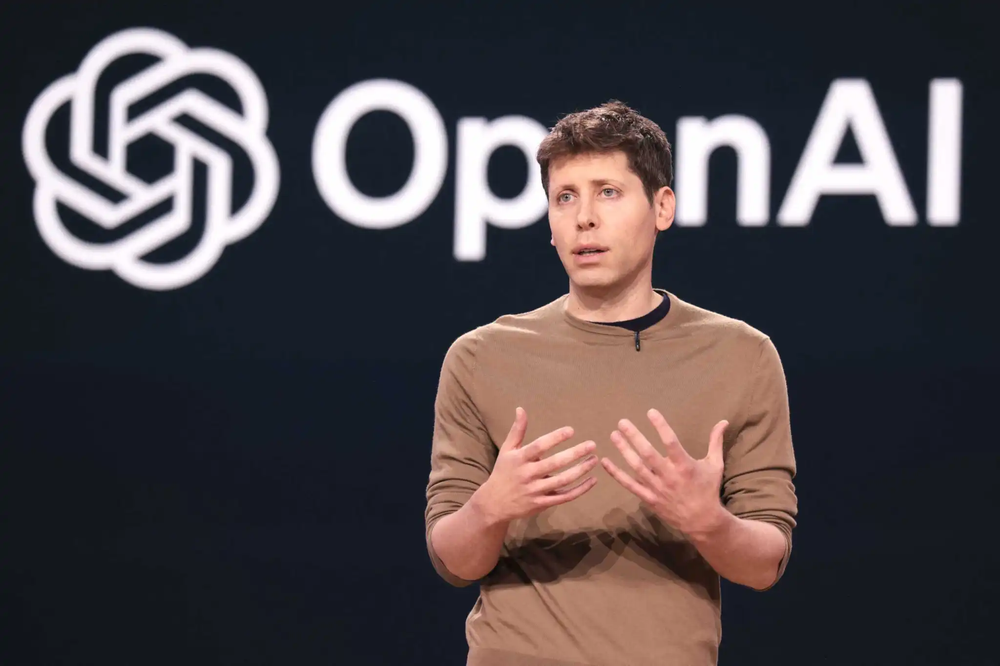

# La medicina sagrada que atrae a los CEOs

Testimonios sobre sanación con ayahuasca, los efectos de esta medicina ancestral pueden hacer que una persona vea la vida de otra manera, sane traumas de su pasado y tenga ideas creativas que en tiempos normales nunca se le habrían ocurrido.

Una experiencia absolutamente increíble. Con estas palabras, Sam Altman, cofundador y director ejecutivo de OpenAI —la empresa matriz de ChatGPT—, se unió a los líderes de la élite tecnológica que han experimentado con plantas sagradas como la ayahuasca, una tendencia que parece estar en auge en los últimos tiempos.

Altman contó, en conversación con el podcast Life in Seven Songs, que solía ser una persona “muy ansiosa e infeliz”, hasta que probó psicodélicos que cambiaron su perspectiva de la vida y lo convirtieron en una persona “tranquila”.

“Si me hubieran dicho que un fin de semana de retiro en México podría cambiar eso significativamente, habría dicho que absolutamente no”, sin embargo, después de experimentarlo de primera mano, el magnate dijo que “realmente lo hizo”.

La ayahuasca es una planta sagrada amazónica que ayuda a sanar traumas del pasado y a ver la vida de otra manera, a través de un viaje introspectivo. Las ceremonias deben ser dirigidas por chamanes que guían la experiencia.

Y esta medicina sagrada se está volviendo atractiva para varios líderes tecnológicos en el mundo porque puede mejorar la creatividad y “ayudar” con la ansiedad y otros trastornos, pero también tendría un lado oscuro o negativo si no se hace con las personas adecuadas.